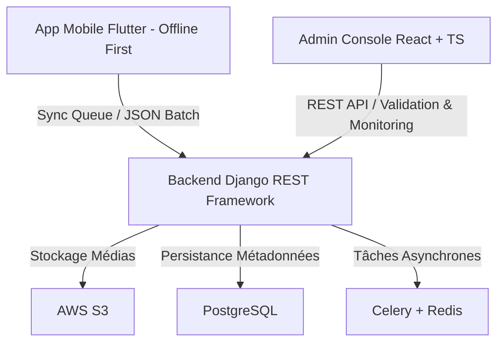

# 🧭 Plateforme Nyansa AI — African Language Agri-Tech AI Data Platform

Nyansa AI est une plateforme haut de gamme et innovante de collecte de données multimodales (audio, image, texte) en zones rurales. Elle a été conçue pour fonctionner de manière déconnectée (*offline-first*), intégrer un moteur anti-fraude avancé et évaluer automatiquement la qualité linguistique des données collectées afin d'alimenter les modèles d'intelligence artificielle dédiés à l'agriculture africaine.

---

## 🏗️ L'Architecture Globale

La plateforme est segmentée en trois composants majeurs interconnectés :



### 📱 1. Application Mobile (Flutter)
Une application mobile optimisée pour le terrain et conçue sous le paradigme ***offline-first***.
*   **Offline Core** : Utilisation d'une base de données locale hautement performante avec **Drift (SQLite)** pour le stockage hors ligne et d'une file d'attente de synchronisation intelligente (`sync_manager.dart`).
*   **Collecte Multimodale** : Enregistrement audio natif avec rendu de la forme d'onde (*waveform*), prise de vue restreinte via l'appareil photo uniquement (importation depuis la galerie désactivée pour éviter les fraudes) et saisie de texte.
*   **Authentification sécurisée** : Authentification OTP par numéro de téléphone combinée avec des tokens JWT.

### 🧠 2. API Backend (Django & DRF)
Le centre névralgique du système gérant la logique métier, la sécurité et le traitement des données.
*   **Moteurs intégrés** : Moteur d'évaluation de la qualité (`quality_engine.py`) et moteur de détection automatique de la fraude (`fraud_engine.py`).
*   **Services asynchrones** : Intégration de **Celery** et **Redis** pour l'exécution des tâches de fond et les calculs lourds.
*   **Gestion des médias** : Liaison avec **AWS S3** via `django-storages` pour une persistance cloud hautement sécurisée.

### 🖥️ 3. Interface d'Administration (React, TypeScript & Vite)
Un tableau de bord moderne destiné aux experts linguistiques, coordinateurs de terrain et administrateurs.
*   **Console de Validation** : Lecteur audio natif, visionneuse d'images et outils d'approbation rapide.
*   **Gestion des experts** : Attribution des langues et des dialectes cibles aux experts agréés.
*   **Monétisation et Suivi financier** : Calcul des gains, historique des transactions et gestion des demandes de retrait.

---

## 🚨 Moteur de Détection de Fraude

Le moteur anti-fraude (`backend/core/fraud_engine.py`) analyse chaque soumission selon plusieurs indicateurs pour attribuer un score de fraude ($S_{fraude} \in [0.0, 1.0]$).

### 🔍 Règles et Indicateurs de Fraude

| Indicateur / Risque | Règle de Détection | Impact sur le Score | Flag associé |
| :--- | :--- | :--- | :--- |
| **GPS Absent ou Invalide** | Coordonnées GPS nulles, manquantes ou hors des limites réelles (-90/90, -180/180). | $+0.25$ à $+0.30$ | `missing_gps`, `invalid_gps_coordinates` |
| **Spoofing GPS** | Coordonnées bloquées sur $(0.0, 0.0)$ ("Null Island"). | $+0.50$ | `gps_null_island_spoofing` |
| **Comptes Multiples** | Même identifiant d'appareil (`device_id`) partagé par $\ge 3$ annotateurs différents. | $+0.60$ (ou $+0.20$ si $\ge 1$) | `device_multi_account`, `device_shared` |
| **Rapidité Suspecte** | $\ge 20$ soumissions par heure pour une même tâche (ou $\ge 10$ pour alerte). | $+0.70$ (ou $+0.30$ si $\ge 10$) | `submission_rate_too_high`, `submission_rate_elevated` |
| **Doublon Exact (Fichier)** | Empreinte MD5 du fichier identique à un fichier déjà enregistré pour cette tâche. | $+0.90$ | `exact_duplicate_file` |
| **Doublon Exact (Texte)** | Texte de la soumission identique à une soumission existante. | $+0.85$ | `exact_duplicate_text` |
| **Qualité Audio Insuffisante**| Fichier audio trop court ($< 5\text{s}$) ou extrêmement court ($< 2\text{s}$). | $+0.40$ à $+0.80$ | `audio_too_short`, `audio_extremely_short` |
| **Texte Répétitif** | Ratio de mots uniques $< 20\%$ sur le texte soumis (ou $< 40\%$ pour alerte). | $+0.60$ (ou $+0.30$) | `highly_repetitive_text`, `low_variation_text` |
| **Texte non Linguistique** | Ratio de caractères alphabétiques $< 50\%$ (caractères spéciaux/chiffres uniquement). | $+0.30$ | `insufficient_linguistic_content` |
| **Contenu généré par IA** | Détection de tournures typiques d'IAs ("As an AI...", "Sure, certainly...", etc.). | $+0.70$ | `suspected_ai_generated` |

### 🛑 Rejet automatique des soumissions
Si le score de fraude final dépasse **`0.8`**, la soumission est **automatiquement rejetée** (`status = 'rejected'`). Sinon, son statut est défini sur `pending` en attente de vérification par un expert.

---

## 📊 Formule de Scoring de Qualité

Chaque soumission reçoit un score final calculé automatiquement lors de sa sauvegarde en base de données. Ce score pondère la qualité linguistique, la clarté audio, la cohérence dialectale ainsi que la diversité contextuelle, tout en pénalisant les comportements suspects :

$$S_{final} = \max\Big(0.0, \big(0.4 \times S_{linguistique}\big) + \big(0.2 \times S_{audio}\big) + \big(0.2 \times S_{dialecte}\big) + \big(0.1 \times S_{diversite}\big) - \big(0.3 \times S_{fraude}\big)\Big)$$

*   **$S_{linguistique}$** ($0.2$ à $0.9$) : Évalue la syntaxe, la pertinence et la longueur du texte.
*   **$S_{audio}$** ($0.8$ par défaut) : Évalue la qualité acoustique (bruits de fond, silence).
*   **$S_{dialecte}$** ($0.5$ de base, jusqu'à $+0.2$ selon la priorité) : Analyse la conformité avec le dialecte de la région ciblée.
*   **$S_{diversite}$** ($0.6$ par défaut) : Mesure la diversité sémantique pour éviter la redondance des bases d'apprentissage.
*   **$S_{fraude}$** ($0.0$ à $1.0$) : Pénalité calculée par le moteur de fraude (`FraudEngine`).

*Pour des besoins de rétrocompatibilité, la note globale de qualité (`quality_score`) est calculée via la moyenne simple des scores linguistiques et audios :*
$$S_{qualite\_legacy} = \frac{S_{audio} + S_{linguistique}}{2}$$

---

## ⚙️ Installation & Démarrage (Développement)

### 1. Backend (Django)

Assurez-vous d'avoir Python 3.10+ installé.

```bash
# 1. Accéder au répertoire backend
cd backend

# 2. Créer l'environnement virtuel
python -m venv venv

# 3. Activer l'environnement virtuel
# Sur Windows :
.\venv\Scripts\activate
# Sur macOS/Linux :
source venv/bin/activate

# 4. Installer les dépendances
pip install -r requirements.txt

# 5. Configurer les variables d'environnement
cp .env.example .env
# Renseigner les variables de base dans le fichier .env

# 6. Exécuter les migrations de base de données
python manage.py migrate

# 7. Initialiser les données de test (Seeding)
python seed_data.py
python seed_dialects.py
python seed_missions.py
python seed_prompts.py

# 8. Lancer le serveur de développement
python manage.py runserver
```

### 2. Frontend (React + Vite)

```bash
# 1. Accéder au répertoire frontend
cd frontend

# 2. Installer les paquets npm
npm install

# 3. Lancer l'application web
npm run dev
```

### 3. Application Mobile (Flutter)

```bash
# 1. Accéder au répertoire mobile
cd mobile

# 2. Récupérer les dépendances Flutter
flutter pub get

# 3. Générer les classes Drift (SQLite) pour la base hors ligne
flutter pub run build_runner build --delete-conflicting-outputs

# 4. Lancer l'application sur un émulateur ou appareil physique
flutter run
```

---

## 🐳 Déploiement avec Docker

Pour lancer l'ensemble de l'écosystème (Backend + Frontend + Base de données PostgreSQL) en une seule commande, utilisez Docker.

### Prérequis
*   Docker & Docker Compose installés.

### Commandes de déploiement rapides

```bash
# 1. Construire les images Docker localement
# Image Backend :
docker build -f Dockerfile.backend -t muse13/nyansa-backend:latest .

# Image Frontend :
docker build -f Dockerfile.frontend -t muse13/nyansa-frontend:latest .

# 2. Lancer l'ensemble des conteneurs en tâche de fond (détaché)
docker compose up -d

# 3. Visualiser les logs en temps réel
docker compose logs -f

# 4. Arrêter le déploiement
docker compose down
```

Une fois démarré, accédez aux services sur les ports configurés :
*   **Console d'administration** : [http://localhost:5173](http://localhost:5173)
*   **Documentation interactive Swagger** : [http://localhost:8000/swagger/](http://localhost:8000/swagger/)
*   **Documentation interactive ReDoc** : [http://localhost:8000/redoc/](http://localhost:8000/redoc/)

---

## 📡 Documentation de l'API (Endpoints Principaux)

Tous les endpoints de l'API sont préfixés par `/api/v1/`.

### 🔐 Authentification & Profils
*   `POST /auth/request-otp/` : Demander un code OTP de connexion par SMS (Twilio).
*   `POST /auth/verify-otp/` : Valider le code OTP et générer le couple de tokens JWT.
*   `POST /auth/token/refresh/` : Rafraîchir un token d'accès JWT expiré.
*   `GET /auth/profile/` : Récupérer le profil de l'utilisateur connecté.
*   `POST /login/` : Authentification standard par identifiants (pour l'administration).

### 📋 Gestion des Missions & Données
*   `GET /tasks/` : Liste des missions de collecte disponibles (filtrables par langue/type).
*   `POST /submissions/` ou `POST /data-entries/` : Téléverser une nouvelle soumission (support multimodale complet).
*   `POST /sync/` : Endpoint optimisé pour la synchronisation en lot (*batch*) depuis la file d'attente mobile hors ligne.
*   `POST /score/<entry_id>/` : Déclencher manuellement l'évaluation de fraude et de qualité pour une soumission donnée.

### 👔 Experts & Administration
*   `GET /dashboard/metrics/` : Statistiques globales pour le tableau de bord admin (taux de fraude, volume d'audio, etc.).
*   `GET /validate/` : Liste des soumissions en attente de validation.
*   `POST /validate/<entry_id>/` : Valider ou rejeter manuellement une soumission en attribuant une appréciation.
*   `GET /languages/` & `GET /dialects/` : Liste et configuration des langues africaines gérées par la plateforme.
*   `GET /experts/` : Gestion des experts linguistiques agréés.
*   `GET /payments/` : Historique des paiements de récompenses aux collecteurs et agents.

---

*Propriété exclusive de NYANSA. Conçu pour le futur de la recherche agronomique et technologique en Afrique.*
